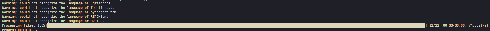
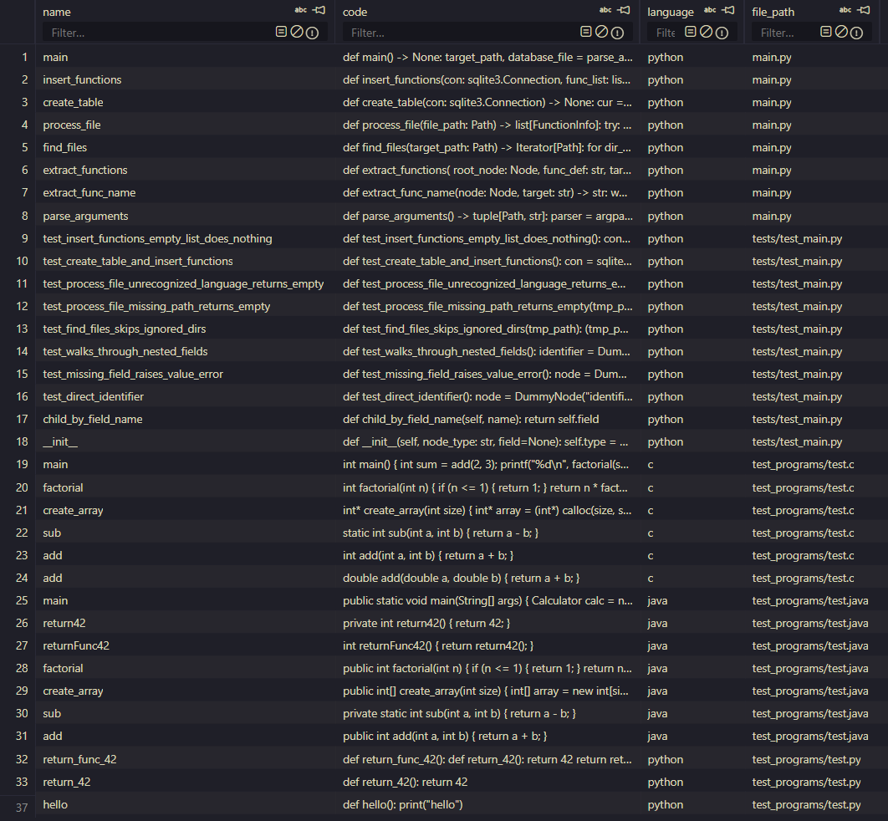

# Function Extractor

**Function Extractor** - утилита для извлечения определений функций из исходного кода на языках **C**, **Java** и **Python**.

---

Программа выполняет следующие шаги:

1. Обходит директорию проекта, данного на вход.
2. Для каждого файла определяет язык программирования.
3. Строит синтаксическое дерево (AST) с помощью tree-sitter.
4. Извлекает коды функций.
5. Сохраняет полученную информацию в реляционную базу данных SQLite.

## Ограничения

- Поддерживаются только три языка: **Python**, **C**, **Java**. Файлы на других языках пропускаются.
- Если файл не удалось однозначно распознать ни на одном из поддерживаемых языков, программа выводит предупреждение в консоль и пропускает его - выполнение не прерывается.

## Используемые технологии

Проект реализован на языке **Python** и использует следующие библиотеки и инструменты:

- **tree-sitter** - построение синтаксического дерева и извлечение кодов функций;
- **SQLite** - хранение информации о найденных функциях;
- **tqdm** - отображение индикатора выполнения при обработке файлов;
- **pathlib** - работа с файловой системой;
- **argparse** - обработка аргументов командной строки;
- **pytest** - тестирование функций

## Установка

### Требования

- Python 3.12 или новее (версия зафиксирована в `.python-version`)
- Менеджер зависимостей uv

### Клонирование репозитория

```bash
git clone https://github.com/andreyphm/func-extractor.git
cd func-extractor
```

### Установка зависимостей

```bash
uv sync
```

Команда создаст виртуальное окружение `.venv` и установит все зависимости автоматически.

## Использование

### Анализ директории

```bash
uv run python main.py <директория_проекта> <база_данных.db>
```

### Анализ одного файла

```bash
uv run python main.py <файл_проекта> <база_данных.db>
```

### Структура базы данных

Результаты сохраняются в таблицу `functions`:

| Поле        | Тип  | Описание                            |
|-------------|------|-------------------------------------|
| name        | TEXT | Имя функции                         |
| code        | TEXT | Исходный код функции                |
| language    | TEXT | Язык программирования               |
| file_path   | TEXT | Путь к файлу, где объявлена функция |

## Пример работы

```bash
uv run python main.py . functions.db
```

### Вывод в терминале



### Содержимое таблицы



## Тестирование

Запуск тестов из **tests/test_main.py**:

```bash
uv run pytest -v
```
